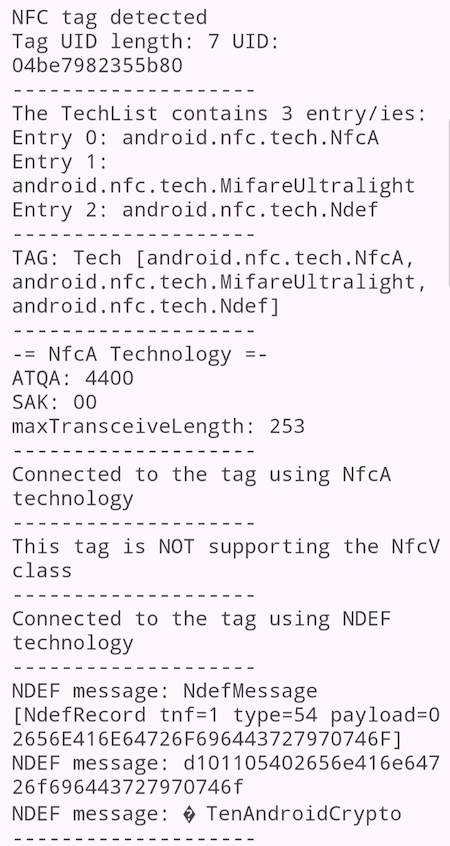

# Android Basic NFC Reader

This is a simple app showing how to detect and read some data from an NFC tag tapped to the Android's NFC reader.

As there are a lot of questions on Stackoverflow.com that use an **Intent-based** NFC detection system I'm showing here how to use the more modern **Reader Mode** for NFC communication.

This is from an answer by *[Andrew](https://stackoverflow.com/users/2373819/andrew)* regarding the two modes:

*Also note that using enableForegroundDispatch is actually not the best way to use NFC. Using enableReaderMode is a newer and much better API to use. NFC.enableReaderMode does not use Intent's and gives you more control, it is easy to do NFC operations in a background Thread (which is recommended), for writing to NFC Tag's it is much more reliable and leads to less errors.*

This application is described in an tutorial on medium.com: **[How to use NFC Reader Mode in Android to connect to NFC tags (Java)](https://medium.com/@androidcrypto/how-to-use-nfc-reader-mode-in-android-to-connect-to-nfc-tags-java-d70641a5def4)**

There are 4 simples steps to **implement the Reader mode**:

1) in `AndroidManifest.xml` add one line: `<uses-permission android:name="android.permission.NFC" />`
2) in your activity or fragment expand your class definition by `implements NfcAdapter.ReaderCallback`
3) create an `onTagDiscovered` method where all the work with the tag is done.
4) create an `onResume` method to define the technologies and settings for the Reader Mode:

```plaintext
@Override                                                                                      
protected void onResume() {                                                                    
    super.onResume();                                                                          
    if (myNfcAdapter != null) {                                                                
        if (!myNfcAdapter.isEnabled())                                                         
            showWirelessSettings();                                                            
        Bundle options = new Bundle();                                                         
        // Work around for some broken Nfc firmware implementations that poll the card too fast
        options.putInt(NfcAdapter.EXTRA_READER_PRESENCE_CHECK_DELAY, 250);                     
        // Enable ReaderMode for all types of card and disable platform sounds                 
        // The option NfcAdapter.FLAG_READER_SKIP_NDEF_CHECK is NOT set                        
        // to get the data of the tag after reading                                            
        myNfcAdapter.enableReaderMode(this,                                                    
                this,                                                                          
                NfcAdapter.FLAG_READER_NFC_A |                                                 
                        NfcAdapter.FLAG_READER_NFC_B |                                         
                        NfcAdapter.FLAG_READER_NFC_F |                                         
                        NfcAdapter.FLAG_READER_NFC_V |                                         
                        NfcAdapter.FLAG_READER_NFC_BARCODE |                                   
                        NfcAdapter.FLAG_READER_NO_PLATFORM_SOUNDS,                             
                options);                                                                      
    }                                                                                          
}                                                                                              
```
The flags are responsible for defining the NFC classes the NFC reader should detect. If you e.g. delete 
the line `NfcAdapter.FLAG_READER_NFC_A` your app will not detect any NFC tags using the NfcA technology.  

The last flag `NfcAdapter.FLAG_READER_NO_PLATFORM_SOUNDS` is useful for a better user experience. Using 
the **Intent based** mode a system sound will appear when the NFC tag is detected **at the beginning**. 
This causes some uses to move the NFC tag out of the reader field and you receive a "Tag Lost Exception". 
When using the **Reader Mode** the flag prohibits the device to give any feedback to the user. In my app 
I'm playing a short *beep* **at the end** or the reading process, signalizing that everything is done. 

Note: **the `onTagDetected` method is not running on the User Interface (UI) thread**, so you are not allowed to write directly to any UI elements like 
e.g. TextViews or Toasts - you need to encapsulate them in a `run onUiTHread` construct. This method is running in an background thread:
```plaintext
runOnUiThread(() -> {
   Toast.makeText(getApplicationContext(), message, Toast.LENGTH_SHORT).show();
});
```

## Steps to read an NFC tag using Reader Mode

Here are some commands to get the first information's about the tag:

`byte[] tagUid = tag.getId();`: receive the tag Unique Identifier (the length depending on tag type).
`String[] techlist = tag.getTechList();`: this is very important as the **NFC tag informs us about the NFC technologies 
it is been able to communicate** with us (e.g. *android.nfc.tech.NfcA*).

Now it is time to **assign the received tag to an NFC technology class**, e.g. to the NDEF class. It is 
important to double check that the ndef variable is not NULL to avoid any errors. If e.g. the ndef-var is not 
null you can **connect** to the NFC tag. Always surround the tag operations with a *try.. catch* clause.

### Example workflow for an NfcA type tag

From the tag I'm getting the *ATQA* and *SAK* value - they are required to identify an NfcA tag on the first level. 
The *maxTransceiveLength* is important when trying to read data from tag - if the data length including some 
protocol bytes is extending this maximum you will receive an error from your device, as the maximum is the 
size of your device's NFC reader unit.

The next steps would be to send commands to the tag using the `transceive` method. I don't show any code for this 
within the app as commands are tag specific.

Please don't forget to close the NfcA class after your work is done. 

```plaintext
NfcA nfcA = null;                                                               
nfcA = NfcA.get(tag);                                                           
if (nfcA == null) {                                                             
    output += "This tag is NOT supporting the NfcA class" + "\n";               
    output += lineDivider + "\n";                                               
} else {                                                                        
    // I'm trying to get more information's about the tag and connect to the tag
    byte[] atqa = nfcA.getAtqa();                                               
    byte sak = (byte) nfcA.getSak();                                            
    int maxTransceiveLength = nfcA.getMaxTransceiveLength();                    
                                                                                
    output += "-= NfcA Technology =-" + "\n";                                   
    output += "ATQA: " + bytesToHex(atqa) + "\n";                               
    output += "SAK: " + byteToHex(sak) + "\n";                                  
    output += "maxTransceiveLength: " + maxTransceiveLength + "\n";             
    output += lineDivider + "\n";                                               
                                                                                
    try {                                                                       
        nfcA.connect();                                                         
        output += "Connected to the tag using NfcA technology" + "\n";          
        output += lineDivider + "\n";                                           
        nfcA.close();                                                           
    } catch (IOException e) {                                                   
        output += "NfcA connect to tag IOException: " + e.getMessage() + "\n";  
        output += lineDivider + "\n";                                           
    }                                                                           
}                                                                               
```

### Example workflow for an NDEF Message

This example has a very limited NDEF workflow and just print out the raw NDEF data. Usually you will divide 
the NDEF Message in separate NDEF records and work with the data depending on the NDEF Record type (not shown 
in this app).

Please don't forget to close the technology after reading is done.

```plaintext
Ndef ndef = null;                                                                                    
ndef = Ndef.get(tag);                                                                                
if (ndef == null) {                                                                                  
    output += "This tag is NOT supporting the NDEF class" + "\n";                                    
    output += lineDivider + "\n";                                                                    
} else {                                                                                             
    try {                                                                                            
        ndef.connect();                                                                              
        output += "Connected to the tag using NDEF technology" + "\n";                               
        output += lineDivider + "\n";                                                                
        NdefMessage ndefMessage = ndef.getNdefMessage();                                             
        String ndefMessageString = ndefMessage.toString();                                           
        byte[] ndefMessageBytes = ndefMessage.toByteArray();                                         
        output += "NDEF message: " + ndefMessageString + "\n";                                       
        if (ndefMessageBytes != null) {                                                              
            output += "NDEF message: " + bytesToHex(ndefMessageBytes) + "\n";                        
            output += "NDEF message: " + new String(ndefMessageBytes, StandardCharsets.UTF_8) + "\n";
        }                                                                                            
        output += lineDivider + "\n";                                                                
        ndef.close();                                                                                
    } catch (IOException e) {                                                                        
        output += "NDEF connect to tag IOException: " + e.getMessage() + "\n";                       
        output += lineDivider + "\n";                                                                
    } catch (FormatException e) {                                                                    
        output += "NDEF connect to tag RunTimeException: " + e.getMessage() + "\n";                  
        output += lineDivider + "\n";                                                                
    }                                                                                                
}                                                                                                    
```

## Screen after reading a tag with an NDEF message



## Example outputs for some tag types

Below you find outputs for some tags with different technologies involved:

### Example for an NTAG216 tag with NfcA technology:
```plaintext
NFC tag detected
Tag UID length: 7 UID: 04be7982355b80
--------------------
The TechList contains 3 entry/ies:
Entry 0: android.nfc.tech.NfcA
Entry 1: android.nfc.tech.MifareUltralight
Entry 2: android.nfc.tech.NdefFormatable
--------------------
TAG: Tech [android.nfc.tech.NfcA, android.nfc.tech.MifareUltralight, android.nfc.tech.NdefFormatable]
--------------------
-= NfcA Technology =-
ATQA: 4400
SAK: 00
maxTransceiveLength: 253
--------------------
Connected to the tag using NfcA technology
--------------------
This tag is NOT supporting the NfcV class
--------------------
This tag is NOT supporting the NDEF class
--------------------
```

### Example for an NTAG216 tag containing an NDEF message:
```plaintext
NFC tag detected
Tag UID length: 7 UID: 04be7982355b80
--------------------
The TechList contains 3 entry/ies:
Entry 0: android.nfc.tech.NfcA
Entry 1: android.nfc.tech.MifareUltralight
Entry 2: android.nfc.tech.Ndef
--------------------
TAG: Tech [android.nfc.tech.NfcA, android.nfc.tech.MifareUltralight, android.nfc.tech.Ndef]
--------------------
-= NfcA Technology =-
ATQA: 4400
SAK: 00
maxTransceiveLength: 253
--------------------
Connected to the tag using NfcA technology
--------------------
This tag is NOT supporting the NfcV class
--------------------
Connected to the tag using NDEF technology
--------------------
NDEF message: NdefMessage [NdefRecord tnf=1 type=54 payload=02656E416E64726F696443727970746F]
NDEF message: d101105402656e416e64726f696443727970746f
NDEF message: enAndroidCrypto
```

### Example for a MIFARE Classic tag:
```plaintext
NFC tag detected
Tag UID length: 4 UID: 641a35cf
--------------------
The TechList contains 3 entry/ies:
Entry 0: android.nfc.tech.NfcA
Entry 1: android.nfc.tech.MifareClassic
Entry 2: android.nfc.tech.NdefFormatable
--------------------
TAG: Tech [android.nfc.tech.NfcA, android.nfc.tech.MifareClassic, android.nfc.tech.NdefFormatable]
--------------------
-= NfcA Technology =-
ATQA: 0400
SAK: 08
maxTransceiveLength: 253
--------------------
Connected to the tag using NfcA technology
--------------------
This tag is NOT supporting the NfcV class
--------------------
This tag is NOT supporting the NDEF class
--------------------
```

### Example for an NFC enabled Credit Card:
```plaintext
NFC tag detected
Tag UID length: 4 UID: b58fcc6d
--------------------
The TechList contains 2 entry/ies:
Entry 0: android.nfc.tech.IsoDep
Entry 1: android.nfc.tech.NfcA
--------------------
TAG: Tech [android.nfc.tech.IsoDep, android.nfc.tech.NfcA]
--------------------
-= NfcA Technology =-
ATQA: 0400
SAK: 20
maxTransceiveLength: 253
--------------------
Connected to the tag using NfcA technology
--------------------
This tag is NOT supporting the NfcV class
--------------------
This tag is NOT supporting the NDEF class
--------------------
```

### Example for an ICODE SLIX tag with NfcV technology:
```plaintext
NFC tag detected
Tag UID length: 8 UID: 18958608530104e0
--------------------
The TechList contains 2 entry/ies:
Entry 0: android.nfc.tech.NfcV
Entry 1: android.nfc.tech.NdefFormatable
--------------------
TAG: Tech [android.nfc.tech.NfcV, android.nfc.tech.NdefFormatable]
--------------------
This tag is NOT supporting the NfcA class
--------------------
-= NfcV Technology =-
DsfId: 00
maxTransceiveLength: 253
--------------------
Connected to the tag using NfcV technology
--------------------
This tag is NOT supporting the NDEF class
--------------------
```
